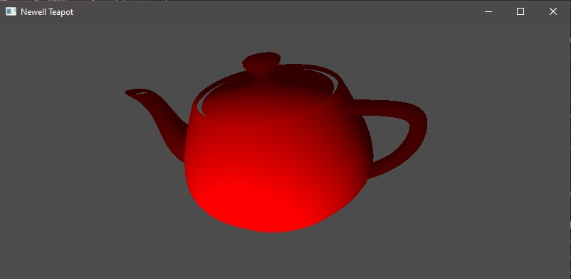
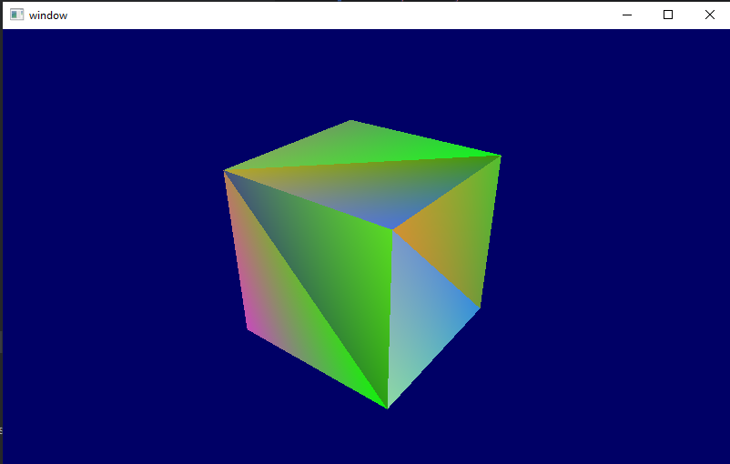
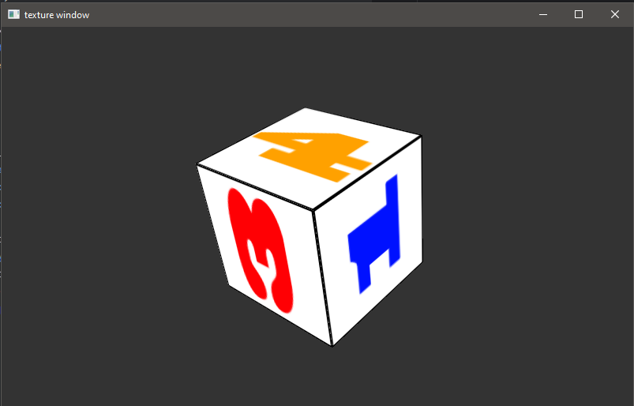

# PicoGL

**PicoGL** is a lightweight, Pythonic wrapper around Modern (and some Legacy) OpenGL — designed to make GPU programming simple, readable, and fun without sacrificing low-level control.

Whether you’re building interactive visualizations, scientific simulations, or games for fun, PicoGL gives you a clean, high-level API to work with shaders, buffers, and pipelines — while still letting you drop down to raw OpenGL when you need it.

---



## ✨ Features

- **Modern OpenGL API** — Focus on shader-based rendering without legacy cruft.
- **Simple, Pythonic interface** — Write less boilerplate, get more done.
- **Full low-level access** — No “black box” abstractions; raw OpenGL calls available anytime.
- **Resource management** — Automatic cleanup of buffers, shaders, and textures.
- **Cross-platform** — Works anywhere Python and OpenGL do.

---

## 🚀 Installation

```bash
    git clone https://github.com/markxbrooks/PicoGL.git
    cd PicoGL
    pip install .
```
or for an editable version:

```bash
    pip install -e .
```
PyPi version coming soon!

##  Example usage to show a cube:
Found in the Examples directory, with mouse control



```python
"""Minimal PicoGL Cube. Compare to tu_01_color_cube.py"""
import os

from examples.data import g_color_buffer_data, g_vertex_buffer_data
from picogl.renderer.object import ObjectRenderer
from picogl.renderer import GLContext, MeshData
from picogl.ui.backend.glut.window.glut_renderer import GlutRendererWindow
from picogl.utils.reshape import float32_row

GLSL_DIR = os.path.join(os.path.dirname(__file__), "glsl", "tu01")


class CubeWindow(GlutRendererWindow):
    """colored cube with no texture"""

    def __init__(self, width, height, title, *args, **kwargs):
        super().__init__(width=width, height=height, title=title, *args, **kwargs)
        self.context = GLContext()
        self.data = MeshData(
            vbo=float32_row(g_vertex_buffer_data),
            cbo=float32_row(g_color_buffer_data),
        )
        self.renderer = ObjectRenderer(
            context=self.context,
            data=self.data,
            glsl_dir=GLSL_DIR
        )
        self.renderer.show_model = True  # set here whether to show the cube


win = CubeWindow(width=800, height=600, title="cube window")
win.initializeGL()
win.run()
```
*With a corresponding renderer

```python
from OpenGL.raw.GL.VERSION.GL_1_0 import GL_TRIANGLES

from picogl.renderer import RendererBase, GLContext, MeshData
from picogl.backend.modern.core.vertex.array.object import VertexArrayObject


class ObjectRenderer(RendererBase):
    """ Basic renderer class """

    def __init__(self,
                 context: GLContext,
                 data: MeshData,
                 base_dir: str):
        super().__init__()
        self.context, self.data = context, data
        self.base_dir = base_dir
        self.show_model = True

    def initialize_shaders(self):
        """Load and compile shaders."""
        self.context.create_shader_program(vertex_source_file="vertex.glsl",
                                           fragment_source_file="fragment.glsl",
                                           base_dir=self.base_dir)

    def initialize_buffers(self):
        """Create VAO and VBOs once."""
        self.context.vertex_array = cube_vao = VertexArrayObject()
        cube_vao.add_vbo(index=0, data=self.data.vbo, size=3)
        cube_vao.add_vbo(index=1, data=self.data.cbo, size=3)

    def render(self) -> None:
        """
        render dispatcher
        """
        if self.show_model:
            self._draw_model()
        # Add more conditions and corresponding draw functions as needed
        self._finalize_render()

    def _draw_model(self):
        """Draw the model_matrix"""
        with self.context.shader, self.context.vertex_array:
            self.context.shader.uniform("mvp_matrix", self.context.mvp_matrix)
            self.context.vertex_array.draw(mode=GL_TRIANGLES, index_count=self.data.vertex_count)

```
## Textured object


```python
"""
Demonstrating textures - compare to tu02_texture_without_normal.py
"""
import os

from examples import g_vertex_buffer_data, g_uv_buffer_data
from picogl.renderer import MeshData
from picogl.ui.backend.glut.window.texture import TextureWindow
from picogl.utils.reshape import float32_row

BASE_DIR = os.path.dirname(os.path.abspath(__file__))

if __name__ == "__main__":
    positions = float32_row(g_vertex_buffer_data)
    uv_buffers = float32_row(g_uv_buffer_data)
    cube_data = MeshData(vbo=positions, uvs=uv_buffers)
    win = TextureWindow(width=800,
                        height=600,
                        title="texture window",
                        data=cube_data,
                        base_dir=BASE_DIR)
    win.initializeGL()
    win.run()
```

## Teapot object


```python
"""Minimal PicoGL Teapot."""
import os
from picogl.ui.backend.glut.window.object_window import ObjectWindow

GLSL_DIR = os.path.join(os.path.dirname(__file__), "glsl", "teapot")

win = ObjectWindow(width=800,
                   height=600,
                   title="Newell Teapot",
                   object_file_name="data/teapot.obj",
                   glsl_dir=GLSL_DIR)
win.initializeGL()
win.run()
```